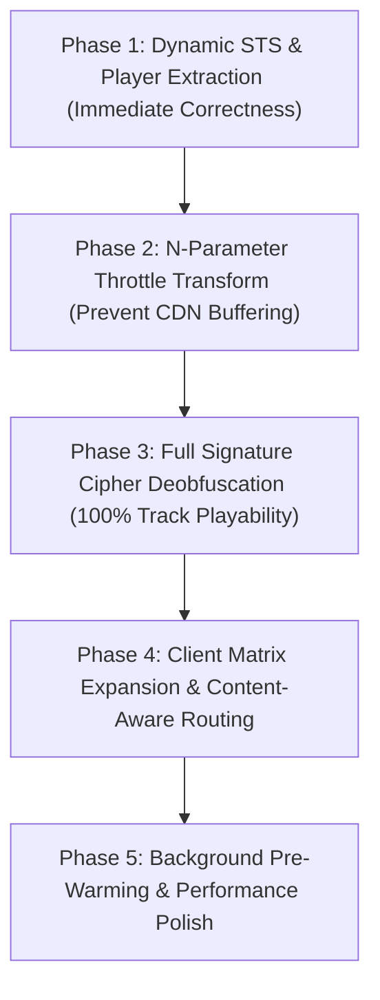

# Master Plan: Hardening Echo YouTube WASM Extension (Option 1)

This master plan outlines the strategic 5-phase progression to bring Echo's YouTube extension (`youtube-wasm`) to full production parity with Metrolist.

---

## 1. Multi-Phase Overview

---

## 2. Phase Summaries & Deliverables

### Phase 1: Dynamic STS & Player Extraction
* **Priority:** P0 (Immediate Correctness)
* **Goal:** Eliminate hardcoded `sts = 20111` causing sudden `400 Bad Request` or `403 Forbidden` on YouTube player rotations.
* **Deliverables:**
  * Fetch `https://www.youtube.com/iframe_api` to locate the active `base.js` player script.
  * Extract `signatureTimestamp` / `sts` dynamically via regex precedence.
  * Cache `sts` and `player_hash` in plugin host storage (`host_storage_set`) with a 6-hour TTL.
  * Implement graceful fallback to cached STS if network is unavailable.
* **Detailed Artifact:** [implementation_plan.md](file:///home/ritwikg/.gemini/antigravity-ide/brain/a3fb8852-d0f0-48f8-8193-867bf5e500c0/implementation_plan.md)

---

### Phase 2: N-Parameter Throttle Transformation
* **Priority:** P0 (Playback Continuity)
* **Goal:** Bypass YouTube CDN's 40–60 kbps bandwidth throttle on untransformed `n` parameters, preventing audio dropouts after 15–30 seconds on 128kbps–256kbps Opus/AAC streams.
* **Deliverables:**
  * Extract active `n` transform function from downloaded `player.js` (detecting modern split-array patterns `var Q = "...".split("}")` and assignments).
  * Send function to host WebView JS VM via `host_execute_webview_js`.
  * Transform `?n=<raw_n>` to `?n=<transformed_n>` on resolved CDN stream URLs.

---

### Phase 3: Full Cipher Deobfuscation (`signatureCipher`)
* **Priority:** P0 (100% Stream Availability)
* **Goal:** Unlock encrypted formats (`signatureCipher`). When fallback clients (`VISIONOS` / `ANDROID_VR`) fail, `WEB_REMIX` will be able to play Vevo, official artist tracks, and 256kbps streams.
* **Deliverables:**
  * Parse `signatureCipher` query params: `s` (obfuscated signature), `sp` (signature parameter key), `url` (stream endpoint).
  * Extract deobfuscation operations (slice, reverse, swap) from `player.js`.
  * Evaluate decipher operations on `s` inside the WebView VM to obtain valid signature.
  * Assemble final authenticated stream URL: `<base_url>&<sp>=<sig>&pot=<video_potoken>`.

---

### Phase 4: Client Matrix Expansion & Content-Aware Routing
* **Priority:** P1 (Coverage & Edge Cases)
* **Goal:** Ensure 100% track resolution across age-restricted, kids, live, and UGC tracks.
* **Deliverables:**
  * Expand client registry to include `TVHTML5`, `TVHTML5_SIMPLY_EMBEDDED_PLAYER`, `IOS`, and `ANDROID_CREATOR`.
  * Implement content-aware routing to switch to TV clients when encountering age-restrictions or embed blocks.

---

### Phase 5: Background Pre-Warming & Performance Polish
* **Priority:** P1 (Latency & Polish)
* **Goal:** Eliminate cold-start playback latency (dropping initial resolve time from ~3.5s to <300ms).
* **Deliverables:**
  * Expose `warmup()` plugin hook invoked during daemon startup.
  * Pre-initialize BotGuard VM, visitorData scraping, and session token minting in background.
  * Add pre-flight stream validation (HTTP `HEAD` / byte-range verification).
